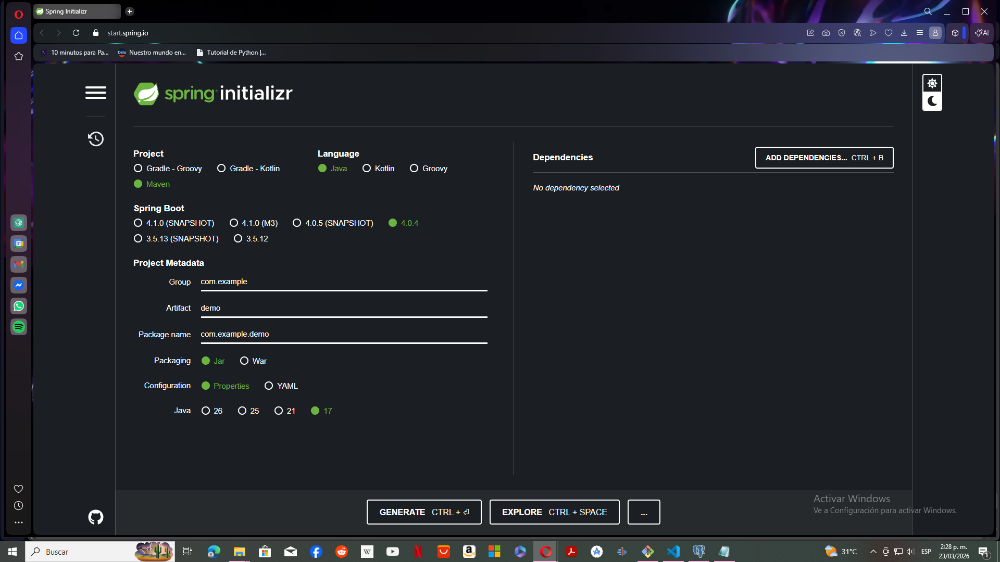
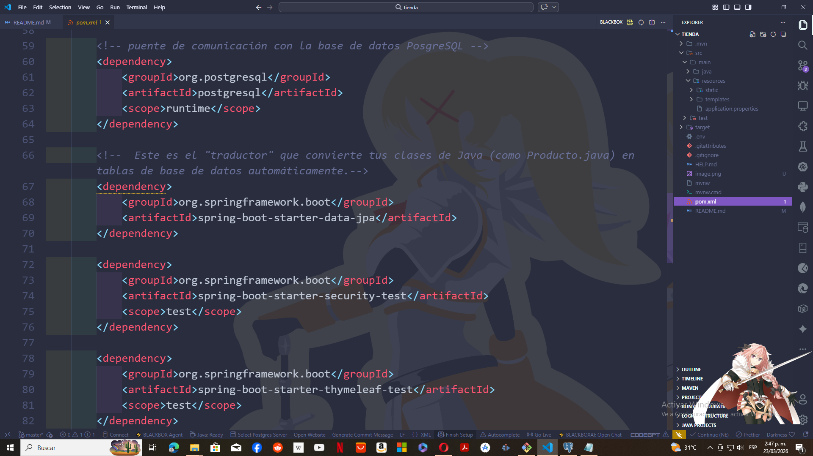
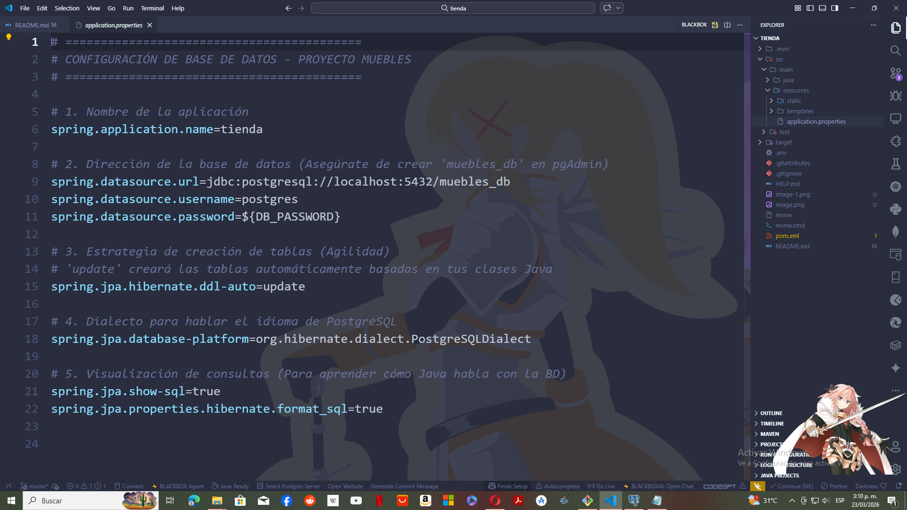

# 📄 Sistema de Gestión: Muebles y Artesanías 🪑
---
**Evidencia:** GA7-220501096-AA3-EV01 - Codificación de módulos del software Stand-alone, web y móvil.

---
## 🧠 Descripcion  dela actividad de aprendizaje 
Actividad de aprendizaje *GA7-220501096-AA3 - Codificar los módulos del software Stand-alone, web y
móvil* 

Esta actividad se centra en la codificación del módulo del proyecto según las características del software a
desarrollar, utilizando Frameworks de Java para el desarrollo ágil. 

**Evidencias:** a continuación, se describen las acciones y las correspondientes evidencias que conforman la
actividad de aprendizaje:

 - **Evidencia de desempeño: GA7-220501096-AA3-EV01 codificación de módulos del software Stand
alone, web y móvil de acuerdo al proyecto a desarrollar**

Con base en la selección del proyecto a desarrollar móvil o web realice la codificación del módulo del proyecto
aplicando alguno de los framework vistos en el componente formativo “Frameworks para construcción de
aplicaciones con JAVA.”.

**Elementos para tener en cuenta:**
Para la codificación del módulo debe tener en cuenta los artefactos del ciclo del software realizados con
anterioridad: 
 - diagrama de clases, diagramas de casos de uso, historias de usuario, diseños, prototipos,
Informe técnico de plan de trabajo para construcción de software con tecnologías seleccionadas etc.
 - El código debe contener comentarios
 - El código debe cumplir con estándares de codificación
 - Se debe crear el proyecto utilizando herramientas de versionamiento.

---

# 📝 Introducción
Este proyecto consiste en el desarrollo de una plataforma robusta para la gestión de inventarios y ventas de una tienda de muebles. Se aplica una arquitectura de tres capas (Presentación, Lógica y Datos) utilizando el lenguaje Java y el framework Spring Boot, garantizando escalabilidad, seguridad y un desarrollo ágil siguiendo metodologías profesionales.

---

# 🎯 Objetivos

## Objetivo General

Codificar los módulos funcionales del software de Muebles y Artesanías, integrando herramientas de desarrollo ágil y bases de datos relacionales para cumplir con los requisitos del cliente.

## Objetivos Específicos
 - Implementar el modelo de datos mediante JPA (Java Persistence API) para la creación automática de tablas.

 - Garantizar la seguridad de la información mediante el uso de variables de entorno (.env).

 - Gestionar el ciclo de vida del proyecto utilizando Maven y el control de versiones con Git.

 - Cumplir con los estándares de codificación y documentación técnica (comentarios Javadoc).

---

# 📂 Estructura de Carpetas
```
tienda/
├── src/main/java/com/miempresa/tienda/
│   ├── model/         # Entidades del sistema (Datos)
│   ├── repository/    # Interfaces de acceso a DB
│   ├── service/       # Lógica de negocio (Servicios)
│   └── controller/    # Puntos de entrada (API/Web)
├── src/main/resources/
│   └── application.properties # Configuración del servidor
├── .env               # Variables sensibles (Ignorado por Git)
├── .gitignore         # Reglas de exclusión de archivos
├── pom.xml            # Gestor de dependencias Maven
└── README.md          # Documentación técnica

``` 

---
# 🛠️ Tecnologías Utilizadas
 - 📎 **Java 17+:** Lenguaje de programación principal.

 - 📎 **Spring Boot 3.x:** Framework para desarrollo rápido de aplicaciones.

 - 📎 **PostgreSQL:** Sistema de gestión de base de datos relacional.

  - 📎 **Maven:** Gestión de dependencias y construcción del proyecto.

 - 📎 **Git / GitHub:** Control de versiones.

---
# 📚 Documentación de Referencia
El desarrollo de este software se basa en los artefactos del ciclo de vida del software diseñados previamente, asegurando la trazabilidad del proyecto:

 -  🔥 **Historias de Usuario (HU-01 a HU-05):** Definen las funcionalidades de compra, catálogo, chat e inventario.

 - 🔥 **Diagrama de Despliegue:** Arquitectura de 3 capas con servidor de aplicaciones (Spring Boot) y base de datos (PostgreSQL). 

 - 🔥 **Modelo de Base de Datos:** Definición de tablas, relaciones y restricciones de integridad.

 - 🔥  **Prototipos (Penpot):** Diseño de la interfaz de usuario para la navegación del catálogo.

---
# ⚙️ Configuración del Proyecto
## 1. Creación con Spring Initializr

El proyecto se generó utilizando Spring Initializr con las siguientes opciones:
 - **Project:** Maven Project.
 - **Language:** Java.
 - **Packaging:** Jar.
 - **Dependencies:** Spring Web, Spring Data JPA, PostgreSQL Driver, Lombok.


[URL de la pagina Spring initialzr](https://start.spring.io)

---

## 2. Archivo pom.xml

#### 🛠️ Paso 2.1: Entendiendo el archivo pom.xml
 El ***pom.xml (Project Object Model)***. Es muy importante porque  que este archivo es la lista de materiales y herramientas que necesita un maestro de obra para construir tu sistema de "Muebles y Artesanías".

#### 🛠️ Paso 2.2. El Conector de Base de Datos (Driver de PostgreSQL)

Como en el Diagrama de Despliegue se definio que se usarás PostgreSQL, Java necesita un "traductor" para hablar con esa base de datos.
```
<dependency>
    <groupId>org.postgresql</groupId>
    <artifactId>postgresql</artifactId>
    <scope>runtime</scope>
</dependency>

``` 
#### 🛠️ Paso  2.3. El Gestor de Datos (Spring Data JPA)
Este es el "traductor" que convierte las clases de Java (como Producto.java) en tablas de base de datos automáticamente.
```
<dependency>
    <groupId>org.springframework.boot</groupId>
    <artifactId>spring-boot-starter-data-jpa</artifactId>
</dependency>

``` 

#### 🛠️ Paso 2.4. El Asistente de Código (Lombok)
Este es un "atajo" para que no tengas que escribir cientos de líneas de código repetitivo.
```
<dependency>
    <groupId>org.projectlombok</groupId>
    <artifactId>lombok</artifactId>
    <optional>true</optional>
</dependency>

``` 


---
### 3 🚀 Creacion De La Base De Datos En PostgreSQL
Para que esto funcione, debes tener creada o crear  la base de datos física.

 1. Abre tu pgAdmin o la consola de PostgreSQL.

 2. Ejecuta el comando: ***CREATE DATABASE*** muebles_db;

 3. Si no la creas, al arrancar el proyecto verás un error rojo diciendo: ***"FATAL: database "muebles_db" does not exist".***

#### 4. 🚀 Preparar el archivo .env
Abre tu archivo .env en la raíz del proyecto y asegúrate de que tenga esta línea
```
DB_PASSWORD=tu_contraseña_real_aqui

``` 
#### 5. Vincular el .env con application.properties
Ahora, en tu archivo src/main/resources/application.properties, cambia la línea de la contraseña por esta referencia:

```
# Usamos la variable de entorno definida en el archivo .env
spring.datasource.password=${DB_PASSWORD}

``` 
#### 6. El "Truco" para que Spring Boot lea el .env
Por defecto, Spring Boot no lee archivos .env automáticamente. Necesitamos una librería llamada dotenv-java

Agregamos esto en el archivo  **pom.xml** dentro de "dependencies":
```
<!-- Librería para leer variables de entorno desde el archivo .env -->
<dependency>
    <groupId>io.github.cdimascio</groupId>
    <artifactId>dotenv-java</artifactId>
    <version>3.0.0</version>
</dependency>

``` 

#### 7. Asegurar el .gitignore
Como ya se creo el archivo .gitignore, se  verifica que tenga la línea .env. Así, cuando hagas git push, la contraseña se quedará solo en la computadora y en GitHub el archivo application.properties mostrará ${DB_PASSWORD}, manteniendo tu base de datos protegida.


---
# Codificación de la Entidad Producto.java
### 👨‍🏫 ¿Qué es una Entidad en Spring Boot?

En el desarrollo con JPA (Java Persistence API), una "Entidad" es una clase Java que representa una tabla en la base de datos. Gracias a la configuración ddl-auto=update que hicimos en el Paso 2, al escribir esta clase, Spring Boot creará la tabla en PostgreSQL por ti.

### 🛠️ Codificación de Producto.java
Ubícaremos  en la carpeta: 
```
src/main/java/com/miempresa/tienda/model/
``` 


